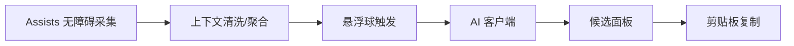

# Ratatoskr

一个“拉塔托斯克式”聊天辅助 App：在即时聊天中，通过无障碍采集上下文，点击悬浮球触发 AI 生成多条候选回复，用户点击即复制（不自动发送）。

## 愿景与灵感
- 灵感来源：《约会大作战》中拉塔托斯克为士道实时推送“三选一”应对方案。
- 愿景目标：为自闭谱系/社恐等需要社交辅助的用户，提供低成本、高质量的回复建议，降低沟通压力，提升沟通掌控感与关系推进的安全性。

## 功能概览
- 无障碍采集：基于 Assists 的无障碍 API 读取聊天文本与上下文（不使用屏幕录制）。
- 悬浮球入口：系统级悬浮球，点击后生成候选并在面板展示。
- AI 生成：默认 3 条候选（稳妥/推进/幽默），可扩展为 3–5 条。
- 点击复制：选择某候选后复制到剪贴板，由用户自主发送。

## 当前状态
- 需求与技术设计文档已完成：`docs/design`。
- 仅集成 Assists 基础库（assists-base），不集成屏幕录制能力。
- 悬浮窗使用 FloatingX + Compose。

## 环境与依赖
- Android：`minSdk=24`，`targetSdk=35`。
- JDK：需要 `Java 17`（AGP 8.x）。
- 仓库：`settings.gradle.kts` 已包含 `maven("https://jitpack.io")`。
- 依赖：
  - Assists（基础库）：`com.github.ven-coder.Assists:assists-base:v3.2.11`
  - FloatingX：`io.github.petterpx:floatingx`、`floatingx-compose`

## 权限与合规
- 必需权限：无障碍服务、悬浮窗、剪贴板访问。
- 隐私原则：最小化上传；仅在用户点击时发送必要上下文；不做自动操作或自动发送。

## 文档导航
- 总体设计：`docs/design/overview.md`
- 无障碍采集（Assists）：`docs/design/accessibility.md`
- 悬浮球与面板：`docs/design/floating-ui.md`
- AI 集成：`docs/design/ai-integration.md`
- 隐私与合规：`docs/design/security-privacy.md`
- 权限与引导：`docs/design/permissions-onboarding.md`
- 状态与数据流：`docs/design/state-dataflow.md`
- 错误与指标：`docs/design/error-handling.md`
- 依赖与环境：`docs/design/dependencies.md`
- 工作拆分与 TODO：`docs/design/todo.md`
- 路线图：`docs/design/roadmap.md`

## 里程碑
- v1.0（MVP）：无障碍读取 → 3 条候选 → 点击复制；悬浮球与面板；权限引导；失败兜底。
- v1.1：风格权重与个性化提示；上下文裁剪优化。
- v1.2：多应用适配与节点健壮解析；限流与重试治理；指标面板。
- v1.3：对话历史的短期缓存与轻量个性化语气配置；隐私设置强化。

## 致谢
- Assists：基于无障碍服务封装的自动化与浮窗能力，简化开发与维护。
