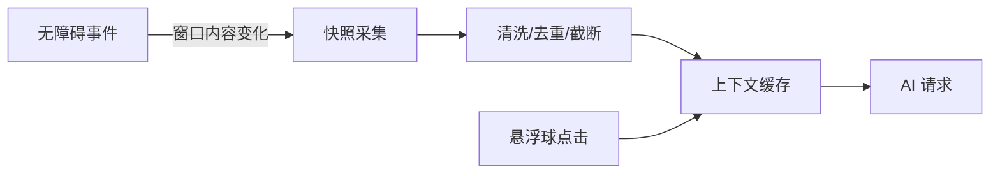

# 无障碍采集设计（基于 Assists）

## 目标
- 可靠读取聊天界面文本与基础上下文，供 AI 生成候选回复。
- 不进行自动化点击、滑动或自动发送操作。

## 集成策略
- 使用本仓库内 `3rd/assists` 提供的 Assists 基础能力（assists-base）。
- 主模块 `AndroidManifest.xml` 注册无障碍服务，并配置 `android.permission.BIND_ACCESSIBILITY_SERVICE` 与 `meta-data`。
- 仅启用必要的事件监听（如窗口内容变化、视图滚动）。

## 数据采集与清洗
- 采集：从当前活动窗口根节点遍历，收集 `text`、`contentDescription`。
- 清洗：
  - 去重：同一行/相邻节点重复文本去重。
  - 截断：上下文最长 2000 字符，避免超长。
  - 过滤：去掉噪声（如时间戳装饰、分隔符过多）。
- 聚合：拼接为带来源顺序的上下文字符串（最近消息优先）。

## 性能与稳定性
- 事件节流：窗口变更时进行节流（如 300–500ms）。
- 线程：采集在后台线程执行，UI 线程仅显示结果。
- 兼容：针对微信等常见 IM 布局进行节点健壮性处理（空节点、懒加载）。

## 安全与合规
- 响应用户显式触发：只有点击悬浮球时才读取并发送上下文。
- 最小化上传：严格控制上传字段，支持脱敏与本地生成模式。

## 流程

## 测试建议
- 权限关闭/未授权：引导用户开启无障碍。
- 空窗口/节点异常：兜底为空上下文+提示。
- 文本超长：截断后生成，以提示“已简化上下文”。
