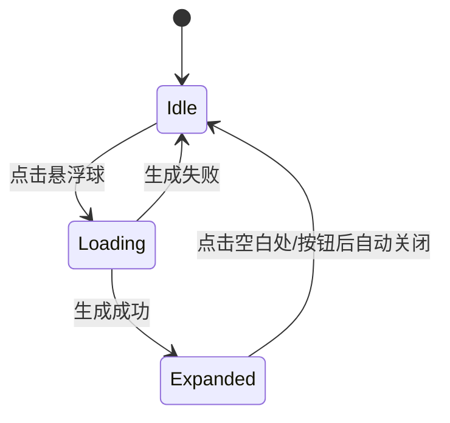

# 悬浮球与候选面板设计

## 目标
- 系统作用域的全局悬浮球入口，点击触发候选生成与展示。
- 面板在悬浮球附近弹出，提供 3–5 条候选回复按钮，点击复制。

## 技术选型
- 采用 FloatingX + Compose（已有依赖），满足系统级浮窗与声明式 UI。
- 后续可评估 Assists 内建浮窗管理器的替换方案。

## 交互规范
- 悬浮球：
  - 非展开态显示“+”；点击进入“生成中”加载态；生成完成后展开，显示“−”。
  - 再次点击“−”收起面板。
- 面板：
  - 居中或相对悬浮球偏移自动避让，点击空白处关闭。
  - 候选按钮宽度自适应，点击即复制并关闭面板。

## 状态机

## 布局与动画
- 布局：容器宽 240dp；候选按钮圆角 16dp；间距 12dp。
- 动画：展开淡入+轻微缩放；关闭淡出；按钮点击后延迟 200–300ms 关闭。

## 无障碍与可访问性
- 候选按钮提供 `contentDescription`；悬浮球可被 TalkBack 聚焦。
- 色彩对比满足可读性；动效时长适中避免眩晕。

## 失败与兜底
- 生成失败：Toast 提示“生成失败，请重试”，保持悬浮球可再次点击。
- 空候选：展示“暂无建议”，提供刷新入口。
