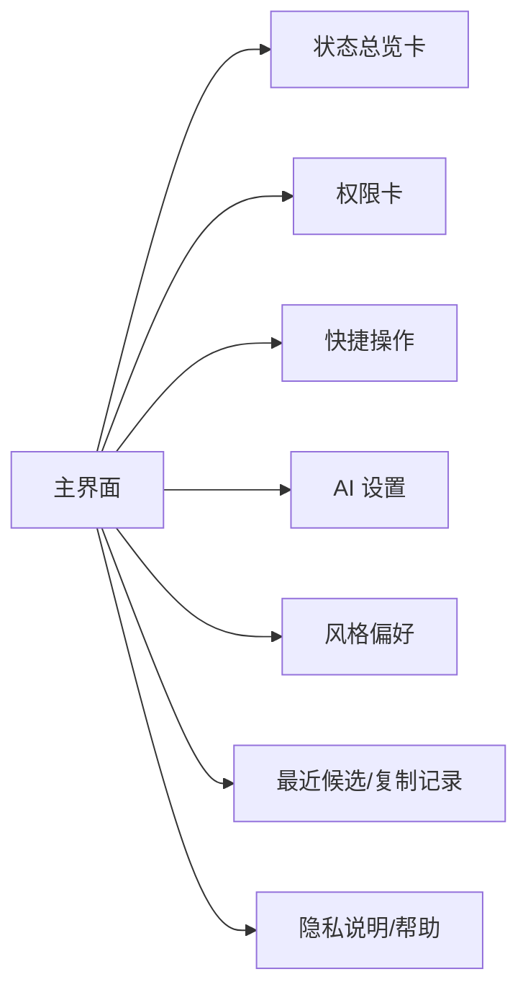
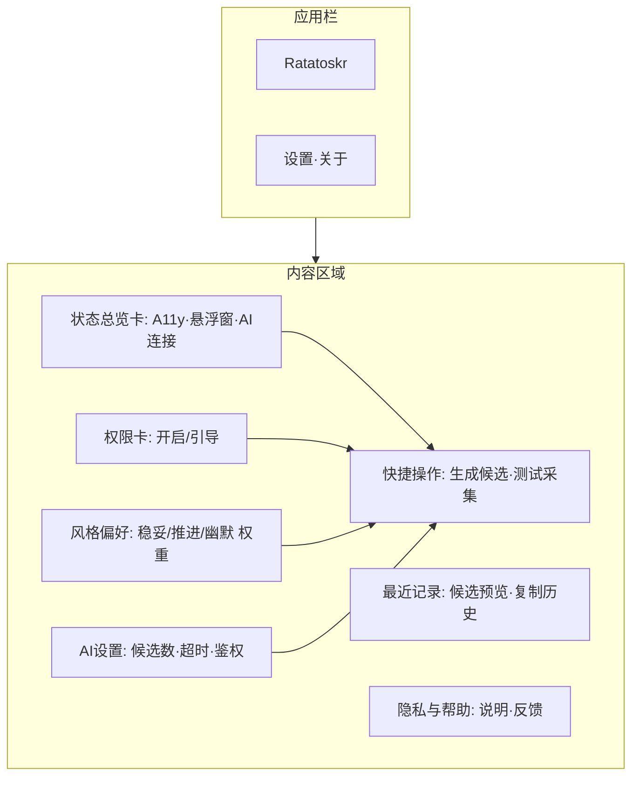
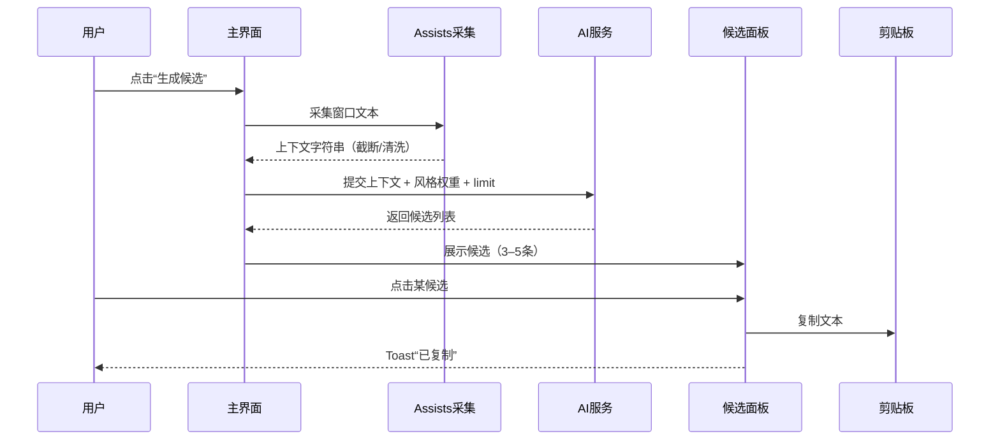

# 应用主界面与功能设计（Home UI）

## 设计目标
- 清晰呈现能力状态（无障碍、悬浮窗、AI）与一键操作入口。
- 以“拉塔托斯克式三选一”为核心，提供低摩擦的候选生成与复制。
- 强调隐私与用户可控：显式触发、最小上传、不自动发送。

## 信息架构

## 布局草图

## 关键交互
- 状态总览卡：
  - 展示 A11y/悬浮窗/AI 的当前状态（已授权/未授权/连接中）。
  - 点击可跳转到对应设置或引导页。
- 权限卡：
  - 显示无障碍与悬浮窗授权情况，提供一键引导到系统设置。
- 快捷操作：
  - 生成候选：触发 Assists 采集 → AI 请求 → 弹出候选面板（或在主页以列表展示）。
  - 测试采集：显示当前采集到的上下文（截断），用于验证权限与解析。
- 风格偏好：
  - 滑杆/分段按钮设置“稳妥/推进/幽默”权重（影响 AI 提示）。
- AI 设置：
  - 候选条数（3–5）、超时（1.5–2.0s）、鉴权 Token。
- 最近记录：
  - 展示最近生成的候选简短预览；点击可复制；仅短期缓存。
- 隐私与帮助：
  - 说明最小化上传/不自动发送；异常处理与反馈渠道。

## 典型流程（主页触发）

## 组件规格
- 状态总览卡：
  - 文案与图标：已授权/需授权/连接失败；支持点击跳转。
  - 颜色：Material3 语义色；强调状态差异。
- 权限卡：
  - 引导按钮：跳转无障碍设置与悬浮窗授权页面。
- 快捷操作：
  - 主按钮：生成候选；次按钮：测试采集。
- 风格偏好：
  - 三段权重选择或 3 个滑杆；提供重置为默认。
- AI 设置：
  - 文本输入/选择器：候选数、超时、鉴权。
- 最近记录：
  - 列表项：label + 20–40 字预览；点击复制；不持久化。

## 无障碍与可访问性
- 所有按钮与卡片提供 contentDescription。
- 动效时长适中；色彩对比符合可读性要求。

## 主题与视觉
- Material3 基础；支持动态颜色；主色与悬浮球保持一致性。
- 组件间间距 8–16dp；卡片圆角 16dp；列表项分隔清晰。

## 空态与错误
- 未授权：主页顶部 Banner 提示“需开启无障碍/悬浮窗”，提供引导按钮。
- AI 失败：提示“生成失败，请重试”，保留重试按钮与本地兜底候选入口。

## 指标与埋点
- 点击“生成候选”次数、成功率与耗时。
- 候选点击率与复制成功率。
- 权限引导点击率与完成率。
