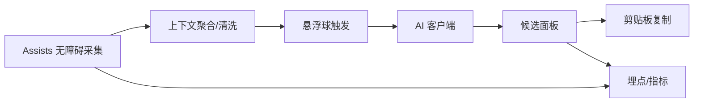
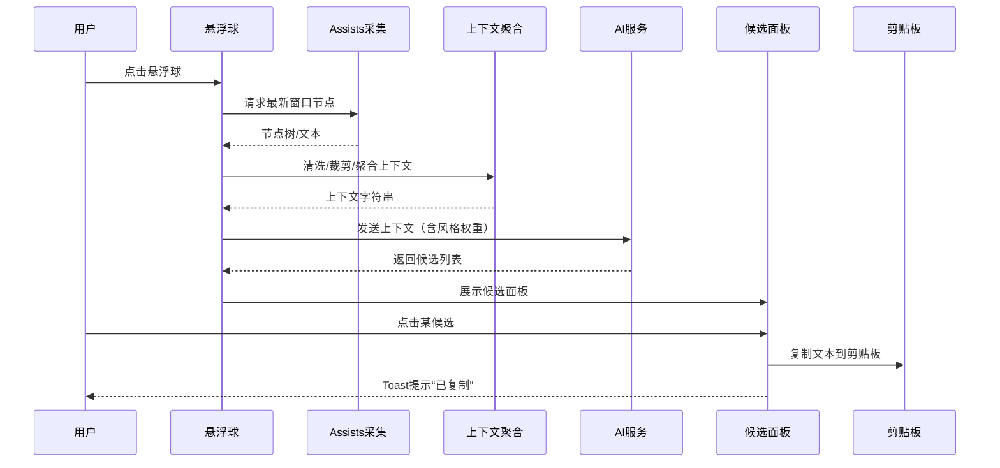

# 总体设计（Overview）

本项目目标是提供“拉塔托斯克式”聊天辅助：在即时聊天中，通过无障碍采集上下文，点击悬浮球触发 AI 生成多条候选回复，用户点击即复制。

## 架构总览

- Assists：作为无障碍能力封装，负责节点读取。
- 上下文聚合：对聊天文本进行去重、截断、清洗。
- 悬浮球触发：系统悬浮球入口，触发 AI 生成。
- AI 客户端：与服务端或本地模型交互，返回候选。
- 候选面板：展示 3–5 条候选，点击复制。
- 指标：生成耗时、点击率、失败率等监控。

## 关键原则
- 最小权限：仅读取界面文本；不做自动点击或自动发送。
- 可控交互：用户显式点击触发；点击候选仅复制不发送。
- 隐私优先：最小化上传；可选脱敏与本地生成。
- 低耦合：Assists、UI、AI 三块相互解耦，便于替换与扩展。

## 典型时序

## MVP 范围
- 无障碍读取文本；默认生成 3 条候选；点击复制。
- 悬浮球 + Compose 面板；权限引导；失败兜底。

## 可演进点
- 风格权重与个性化；多应用适配；上下文优化；离线生成；对话历史。
