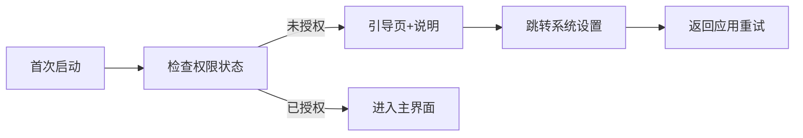

# 权限与用户引导

## 必需权限
- 无障碍服务权限：读取聊天界面文本。
- 悬浮窗权限：显示全局悬浮球。
- 剪贴板访问权限：复制候选文本。

## 引导流程

## 文案建议
- 无障碍用途说明：仅用于读取聊天文本，以生成回复建议，不会自动操作或发送消息。
- 悬浮窗用途说明：用于显示悬浮球与候选面板。

## 失败处理
- 用户拒绝：可继续使用但不提供生成功能；悬浮球显示“需授权”。
- 系统限制：提示兼容性；提供客服/帮助入口。
