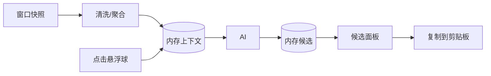

# 状态管理与数据流

## 目标
- 在点击触发时获取最新上下文；候选生成后短暂缓存以便重复查看；长期不保留原文。

## 数据对象
- ChatContext：最近窗口文本的聚合字符串（截断/清洗）。
- Options：AI 返回的候选列表（label + text）。

## 数据流

## 生命周期与清理
- CTX：保持最近一次；超时（如 5 分钟）清空；应用进入后台清空。
- OPTS：显示期间有效；关闭面板后清理。

## 并发与线程
- 采集与清洗在后台线程；UI 展示在主线程。
- 采用线程安全的内存存储（如 AtomicReference）。

## 指标采集
- 生成耗时、候选点击率、失败分类与次数。
