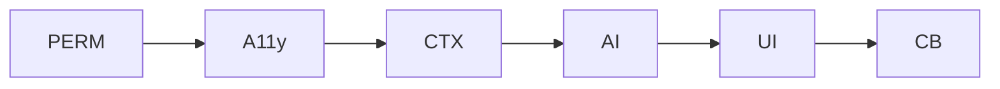

# 工作拆分与 TODO

## 工作包
- 无障碍采集（Assists）
  - 注册与事件监听、节点遍历、清洗与聚合、节流与健壮性。
- 悬浮球与面板（FloatingX + Compose）
  - 悬浮球状态机、面板布局与动画、可访问性标签。
- AI 接入
  - 协议实现、网络栈、超时重试与兜底策略、指标埋点。
- 权限与引导
  - 首次引导流程、系统设置跳转、拒绝与异常处理。
- 隐私与合规
  - 最小化上传、脱敏策略、隐私说明与配置项。
- 指标与治理
  - 延迟、成功率、点击率、错误分类、日志与采样。

## 任务列表
- [ ] Assists 服务注册与事件监听模板
- [ ] 节点遍历与文本聚合模块（去重/截断/清洗）
- [ ] 悬浮球入口与加载/展开/关闭状态机
- [ ] 候选面板 UI（3–5 条候选按钮）
- [ ] 剪贴板复制与提示反馈
- [ ] AI 客户端协议封装与网络栈
- [ ] 超时/重试/兜底策略实现
- [ ] 权限引导页与设置跳转
- [ ] 隐私说明与设置项（候选数、风格权重、本地模式）
- [ ] 指标采集与日志策略

## 依赖关系

- 权限完成后才能启动无障碍采集。
- 无障碍采集产出的上下文用于 AI 生成；生成结果驱动 UI。
